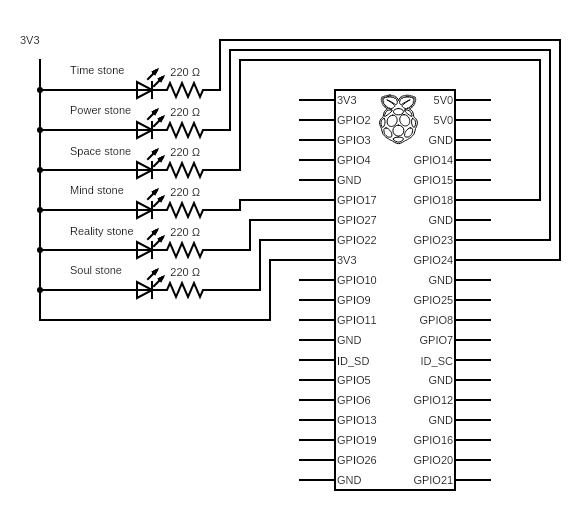

# Iron Gauntlet

This repository contains circuit diagrams and software (for the Raspberry Pi 3/Pi Zero W) to turn the toy [Avengers Marvel Legends Series Endgame Power Gauntlet Articulated Electronic Fist](https://www.amazon.com/gp/product/B07P7WZF11) into an Alexa-enabled smart device with independent control of each of the Infinity stones and a cool, ambient effect using pulse width modulation to control brightness.

While there is an included circuit diagram and a couple images of the physical wiring itself, the focus of this repository is on the software. In particular, it uses Docker to run a [fauxmo](https://github.com/n8henrie/fauxmo) server, turning the device into a reliable appliance that doesn't bork-up occasionally. Because it uses Docker, it also includes configuration to remotely run/edit/debug this repository on-device using [Visual Studio Code Remote Containers](https://code.visualstudio.com/docs/remote/remote-overview) and my own [devcontainer CLI](https://github.com/aniongithub/devcontainer-tools) tool. 

It is primarily intended to be a starting point for other projects - providing modern development tooling to developers working on Linux SBCs.

## Circuit diagram & physical wiring

The glove can be disassembled using a Philips head screwdriver and several layers have to taken off to reveal the gray plastic that houses the SMD leds. You can remove the circuit boards containing the LEDs and chip-on-board to replace the LEDs with [these](https://www.amazon.com/CHANZON-PC-59042-Emitting-Assorted-Arduino/dp/B01AUI4VSI/ref=pd_ybh_a_20?_encoding=UTF8&psc=1&refRID=JCP5C1KQ5P37ZX6H5M1F), or you can choose to solder leads directly onto the boards and cut the wires (and some of the tracks) between the LEDs and the chip-on-board that's by the Mind stone LED.

I tested that everything was working using a bread board and a 40-pin GPIO breakout. Here's the circuit diagram. Since I had a lot of GPIO pins to spare, I used up 6 of them. You can also use a shift register like the 74HC595 to control the 6 LEDs (it has 8 bit parallel output) using just 3 pins. My testing procedure using the CLI `gpio` is detailed below in the software section.

Once everything was tested, I soldered the components onto a [breadboard hat](https://www.amazon.com/gp/product/B07C54DP8T) (with a 40-pin female header) and attached it to the Raspberry Pi (Zero W). After re-assembling the gauntlet, it was time to put get all the software going.

## Software

### Testing
While performing breadboard testing, it's useful to blink a GPIO pin so you can ensure the on gauntlet connection to the LED works. To do this, you can open a terminal in VS Code running within the devcontainer (all tools should be installed) - or ssh into the Raspberry Pi (if you activated the raspberrypi devcontainer) using

`docker-machine ssh <machine-name-here>`

If you aren't using devcontainers (boo) - just SSH into your Pi and install the `wiringPi` package. You should then be able to type

`gpio -1 blink 11`

The `-1` option makes GPIO use phyiscal pin numbers, which are also used in `InfinityStone.py`. Now you can ensure that the connections to your LEDs are correct and steady before/after soldering things together.

## Install as appliance
To simply prep a new RaspberryPi as an appliance, perform the following steps on-device from an SSH shell or local session. Note that the device will need internet connectivity to successfully run the following script so be sure to use `raspi-config` or connect a LAN cable.

1. Clone the repository from Github to a folder of your choice
2. Run `scripts/install.sh` from a terminal

Here's an animated GIF showing the installation steps

## Development

Coming soon! :)
